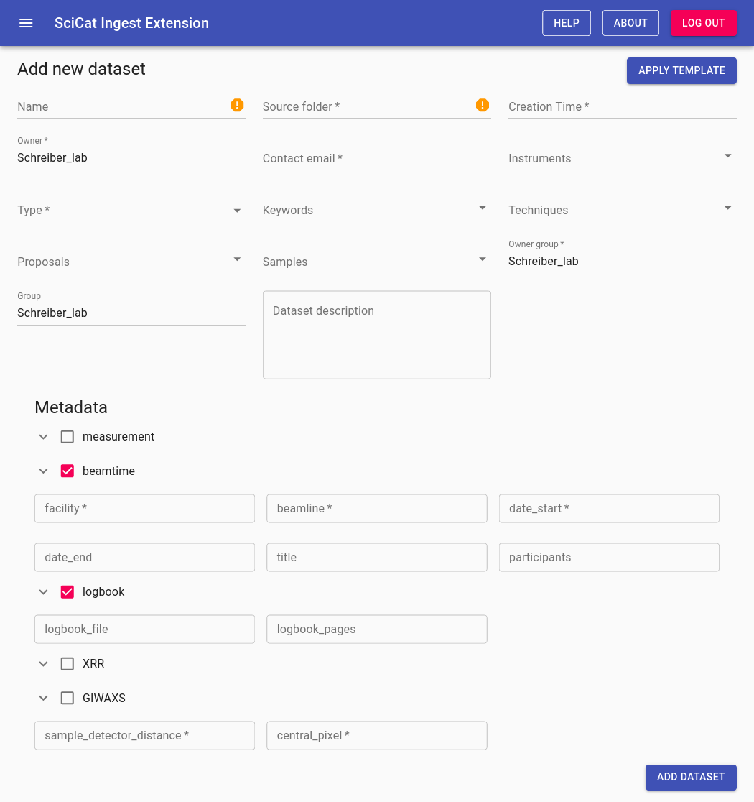
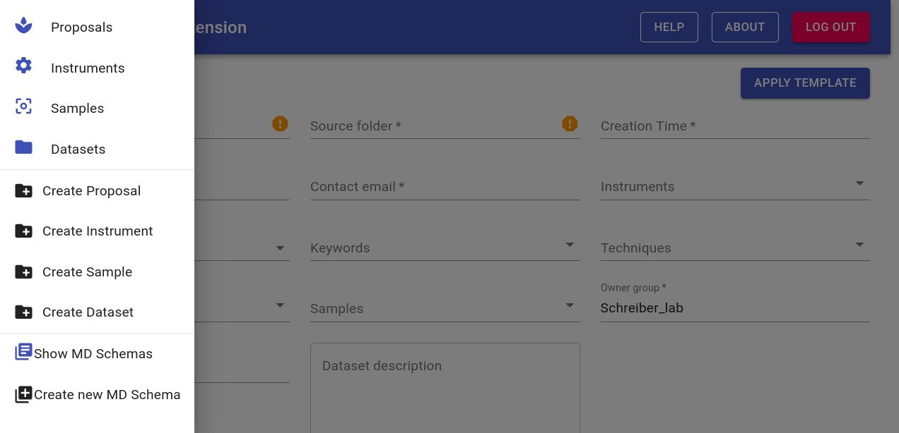

# Upload / ingestion frontend

With this additional service we aim to provide the possibility create Datasets with structured Metadata through a web frontend.
In the given configuration this service that is part of the [Scicat Schema Extension](https://github.com/schreiber-lab/scicat-schema-extension)
is accessible at `http://scicat-host/upload`.

