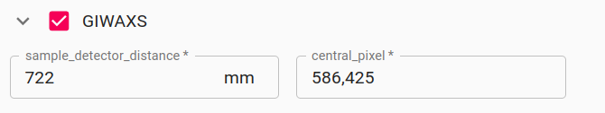
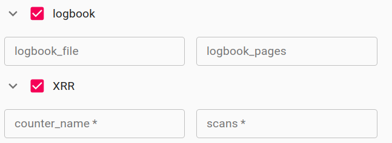

!!! warning  "Project is still under active development"
     Please consider this project in it's current state just as a 
     draft. The api is not yet stable and there may still be important 
     security vulnerabilities. Documentation is still far from being complete.

# Metadata Schemas
One of the unique features of SciCat is its flexibility in capturing Scientific Metadata. However, to assure a systematic (machine readable and AI-ready) structure of the metadata captured in SciCat one approach is to use well defined _Metadata Schemas_. Ideally these schemata are predefined and follow given ontologies (e.g. the PaNdata Ontology) or rules that are accepted in the community (e.g. NeXus). 

Unfortunately for many _use cases_ it is very difficult to agree on a ridged metadata structure beforehand. Here we try to follow a more flexible approach that explicitly allows the creation and modification of _metadata schemas_ any time. This is rather a pragmatic decision mainly due to the fact that for many experimental datasets it is not yet clear which metadata should be captured and to some extend it just postpones the decision on the final, ridged metadata structure. In a way this approach is inspired by what was developed in _AMORE / AMARCORD (EuXFEL)_.

The SciCat Extention proposed here offers the following features:

- Metadata Schemas are stored in the mongoDB of SciCat
- Creation and Management of Metadata Schemas through the web frontend (see ingestion frontend)
- Metadata Schemas can be specific for "Datasets" or "Samples"
- **Validation** to check if of provided metadata follows the available metadata schemas
- 🔶 Support of schemas with a managed catalog of entries


## Schema specification

!!! warning  "Data structure not stable"
    Currently the schema definition is kept close to [cerberus](https://docs.python-cerberus.org/en/stable/) which may change in the future.
    
### Schema structure

```json
  {
    "schema_name": "measurement",
    "schema_type": "dataset"
    "fixed_value_entries": false,
    "keys": [
      {
        "key_name": "measurement_type",
        "type": "string",
        "required": true,
        "unit": null
        "allowed": ["beamtime", "lab"],
        "changes_likely": false,
        "scan_ref": false,
      }
    ],
  }
```

The basic fields in the schema are `schema_name` and `schema_type`, where the type can either be `dataset` or `sample`. `fixed_value_entries` specifies 🔶. For each key in the schema there are the following options:

- `key_name`: field name
- `type`:  valid values are `boolean`, `string`, `number`, `float`, `int`, `list`
- `required`: specifies if a value for this field must be provided in order to pass validation 
- `unit`: if there is a unit attached to this field it can be provided here
- `allowed`: can be used to specify a list of allowed values that will be
- `changes_likely`: highlights fields that are likely to change in case an exiting dataset is used as _template_ for a new one. 
- `scan_ref`: ... not yet used. Intended for validation in case of data references (might be removed in the future)
- `schema`: 🔶 for lists etc.

## Examples of Metadata schemas

🔶 still some text to come...

### Metadata schemas dedicated to a experimental techniques

```json
  {
    "schema_name": "GIWAXS",
    "schema_type": "dataset",
    "fixed_value_entries": false,
    "keys": [
      {
        "changes_likely": true,
        "key_name": "sample_detector_distance",
        "required": true,
        "scan_ref": false,
        "type": "number",
        "unit": "mm"
      },
      {
        "changes_likely": true,
        "key_name": "central_pixel",
        "required": true,
        "scan_ref": false,
        "schema": {
          "type": "number"
        },
        "type": "list",
        "unit": null
      }
    ]
  }
```



### Metadata schemas describing the dataset structure / experimental procedures

```json
  {
    "schema_name": "logbook",
    "schema_type": "dataset",
    "fixed_value_entries": false,
    "keys": [
      {
        "changes_likely": false,
        "key_name": "logbook_file",
        "required": false,
        "scan_ref": false,
        "type": "string",
        "unit": null
      },
      {
        "changes_likely": true,
        "key_name": "logbook_pages",
        "required": false,
        "scan_ref": false,
        "type": "string",
        "unit": null
      }
    ]
  }
```



## Managed schemas
🔶 still to be implemented in frontend...

🔶 The idea here is to have not only the schema in the DB but also a list of know entries to these schemas that can be can be used as metadata.

🔶 Needs more detailed explanation. 

🔶 this is what the `fixed_value_entries` key refers to.

### Example: Material database for samples
One _use-case_ for this could be a sort of DB which contains materials samples can be composed of. Here is an example for such a schema:

```json
{
    "schema_name": "material",
    "schema_type": "sample",
    "multiples_entries": true,
    "fixed_value_entries": true,
    "id_key": "material_id",
    "keys": [
      {
        "changes_likely": true,
        "key_name": "material_id",
        "required": true,
        "scan_ref": false,
        "type": "string",
        "unit": null
      },
      {
        "changes_likely": true,
        "key_name": "full_name",
        "required": false,
        "scan_ref": false,
        "type": "string",
        "unit": null
      },
      {
        "changes_likely": true,
        "key_name": "formula",
        "required": false,
        "scan_ref": false,
        "type": "string",
        "unit": null
      }
    ]
  }
```

and some entries in corresponding database collections would be:

```json
{
    material_id: 'PEN',
    full_name: 'Pentacene',
    formula: 'C22H14'
},
{
    material_id: 'Au',
    full_name: 'gold'
}
```
